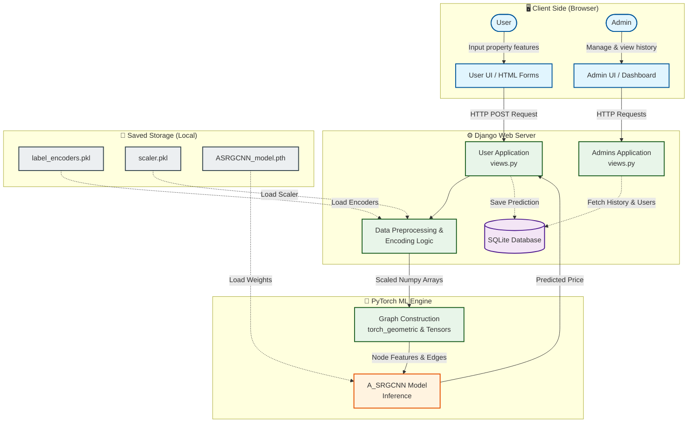
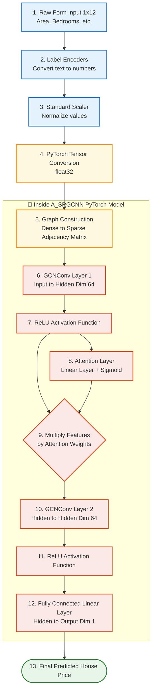

# System Architecture

Based on the code structure and components of your project (Django backend + PyTorch GCN model), I have generated the system architecture diagrams representing how everything connects and processes information.

### 1. High-Level System Architecture
This diagram outlines the overall flow from the client side (User/Admin) through your Django application, and into the Machine Learning engine and Database.

---

### 2. Machine Learning Model Architecture Flowchart
This details the exact step-by-step transformation inside your `A_SRGCNN` model as seen in your `views.py` file, showing how the raw input array becomes a price prediction.

